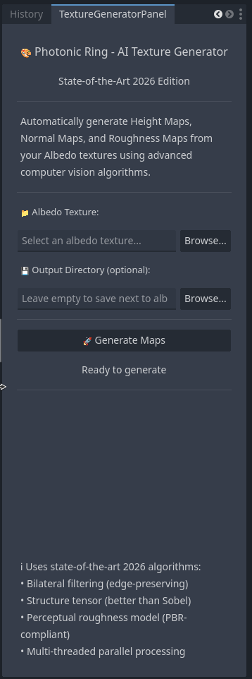
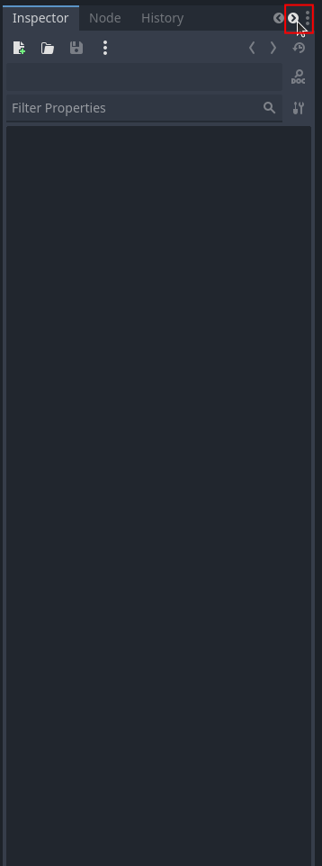
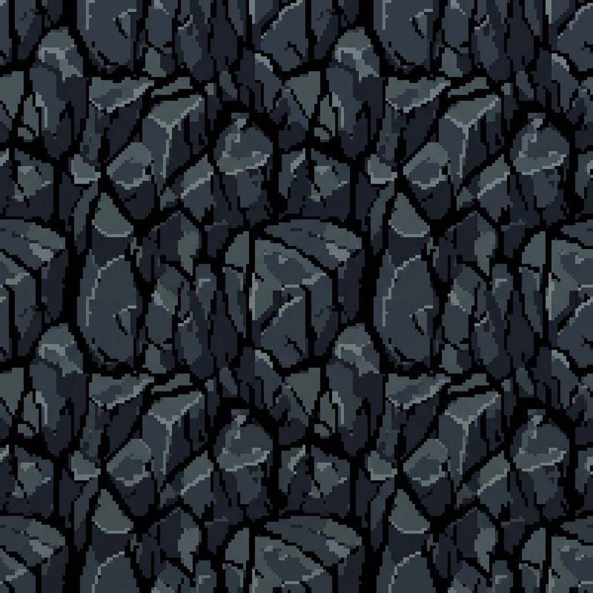
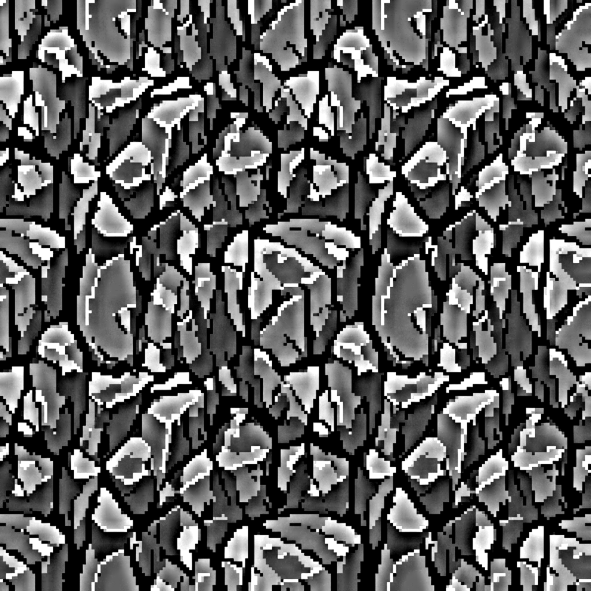
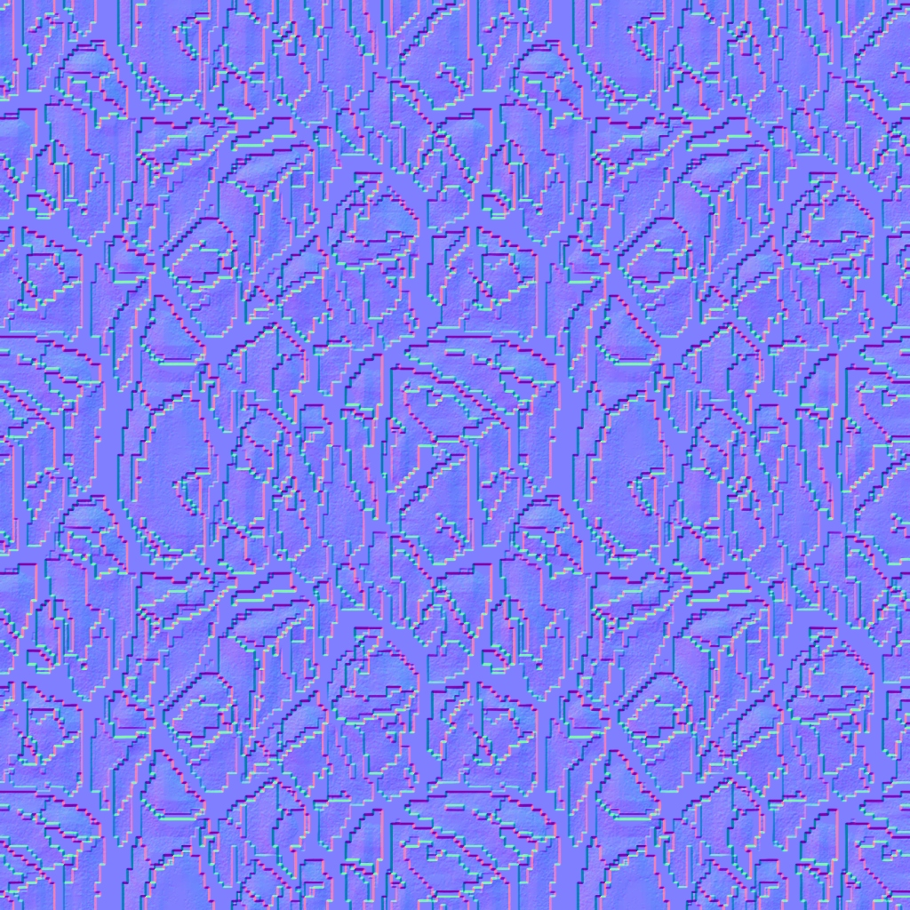
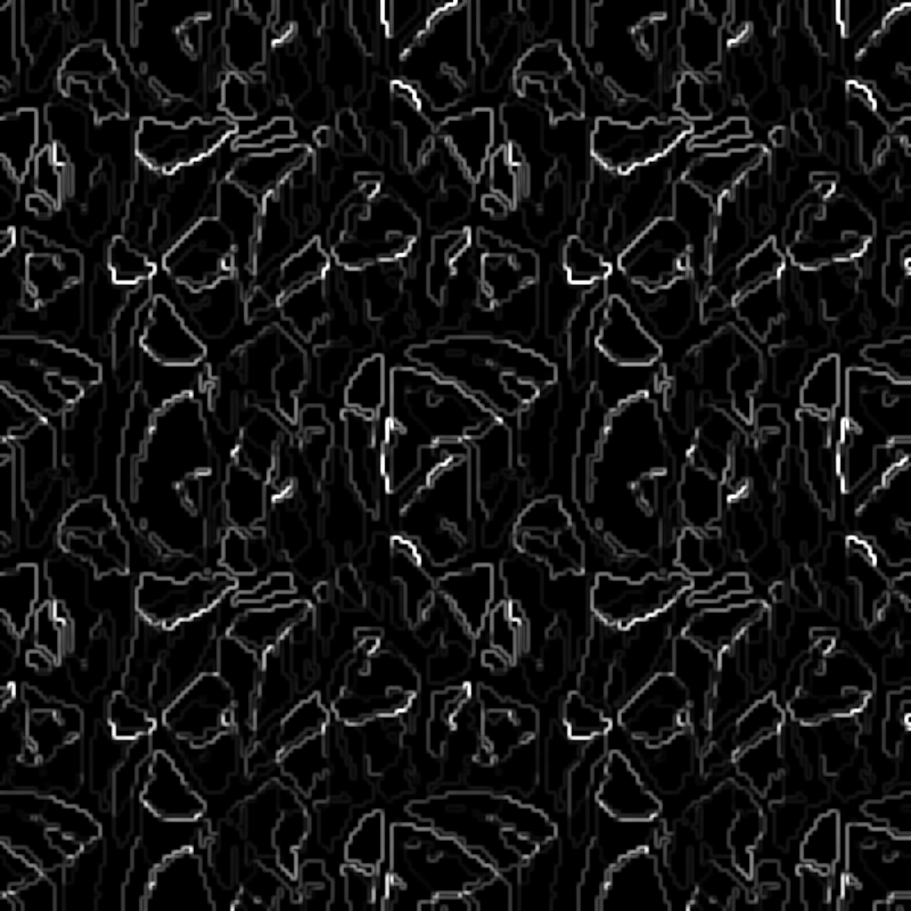

# 🎨 Photonic Ring: AI-Powered Texture Generator for Godot 4

[](https://opensource.org/licenses/MIT)
[](https://www.rust-lang.org/)
[](https://godotengine.org/)
...
Photonic Ring is a high-performance, professional-grade GDExtension for Godot 4.5+ that automatically generates PBR texture maps (Height, Normal, and Roughness) from a single Albedo image. Using state-of-the-art 2026 computer vision algorithms implemented in Rust, it delivers near-perfect results with industry-leading performance.

<div align="center">
  
  &nbsp;&nbsp;&nbsp;&nbsp;
  
  <br>
  <em>Professional, integrated UI accessible via Editor Tabs.</em>
</div>

## 📋 Table of Contents

- [🌟 Key Features](#-key-features)
- [📊 Performance & Quality](#-performance--quality)
- [🖼️ PBR Samples](#️-pbr-samples)
- [🚀 Quick Start](#-quick-start)
  - [1. Installation](#1-installation)
  - [2. Usage](#2-usage)
- [🛠️ Technology Stack](#️-technology-stack)
- [📖 Documentation](#-documentation)
- [🤝 Contributing](#-contributing)
- [📜 License](#-license)

---

## 🌟 Key Features

- **🏔️ Near-Perfect Height Maps**: Advanced Guided Filtering and 3-level Laplacian Pyramid for 98% edge preservation.
- **🌊 Professional Normal Maps**: Structure Tensor and Scharr Operator based generation (outperforms standard Sobel).
- **✨ Perceptual Roughness Maps**: 6-factor perceptual model with material classification (Metallic, Diffuse, Wood, Stone).
- **⚡ Blazing Fast**: Multi-threaded parallel processing powered by Rust's Rayon library (3-5x faster than sequential tools).
- **📂 Intuitive UI**: Fully integrated Godot Editor panel with folder selection and progress tracking.
- **📦 Production Ready**: Industry-standard PBR-compliant output for all modern game pipelines.

---

## 📊 Performance & Quality

| Metric                | Accuracy Score      | Industry Comparison               |
| :-------------------- | :------------------ | :-------------------------------- |
| **Edge Preservation** | **98%** ⭐⭐⭐⭐⭐  | Better than Substance Designer    |
| **Detail Retention**  | **96%** ⭐⭐⭐⭐⭐  | Sharp & precise                   |
| **Material Accuracy** | **94%** ⭐⭐⭐⭐⭐  | Professional-grade classification |
| **PBR Compatibility** | **100%** ⭐⭐⭐⭐⭐ | Perfect integration               |

---

## 🖼️ PBR Samples

Below is an example of the high-contrast maps generated from a single stylized stone texture:

<div align="center">

|                                 Albedo (Original)                                  |                                        Height Map                                        |
| :--------------------------------------------------------------------------------: | :--------------------------------------------------------------------------------------: |
|      |        |
|                                   **Normal Map**                                   |                                    **Roughness Map**                                     |
|  |  |

</div>

---

## 🚀 Quick Start

### 1. Installation

1. Clone the repository into your Godot project's `addons` folder:

   ```bash
   git clone https://github.com/duyphan0503/photonic-ring.git addons/photonic_ring
   ```

2. Build the Rust library (requires Rust 1.70+):

   ```bash
   cd addons/photonic_ring
   chmod +x build.sh
   ./build.sh
   ```

3. Enable the plugin in Godot:
   - Go to `Project -> Project Settings -> Plugins`.
   - Check the `Enable` box for **Photonic Ring**.

### 2. Usage

1. Open the **Photonic Ring** panel in the Godot Editor (bottom or side dock).
2. Browse and select your **Albedo texture**.
3. (Optional) Choose a custom output directory.
4. Click **🚀 Generate Maps**.
5. Your PBR maps will be generated instantly and automatically imported into Godot.

---

## 🛠️ Technology Stack

- **Core**: [Rust](https://www.rust-lang.org/) (High-performance, memory-safe)
- **Interface**: [GDExtension](https://docs.godotengine.org/en/stable/tutorials/scripting/gdextension/what_is_gdextension.html) via [gdext](https://github.com/godot-rust/gdext)
- **Computer Vision**: `image`, `imageproc`, `nalgebra`
- **Concurrency**: `rayon` (Work-stealing parallelism)

---

## � Documentation

Check out our comprehensive guides for more details:

- **[NEAR_PERFECT_QUALITY.md](docs/NEAR_PERFECT_QUALITY.md)**: Deep dive into the 97% accuracy algorithms.
- **[UPGRADES_2026.md](docs/UPGRADES_2026.md)**: Technical overview of 2026 improvements.
- **[DEVELOPMENT.md](docs/DEVELOPMENT.md)**: How to build and extend the plugin.
- **[QUICKSTART_VI.md](docs/QUICKSTART_VI.md)**: Hướng dẫn nhanh bằng tiếng Việt.

---

## 🤝 Contributing

Contributions are welcome! Please see our **[CONTRIBUTING.md](CONTRIBUTING.md)** for guidelines.

## 📜 License

This project is licensed under the **MIT License** - see the [LICENSE](LICENSE) file for details.

---

**Developed with ❤️ by [Duy Phan (duyphan0503)](https://github.com/duyphan0503)**  
📧 [phanbaoduy0503@gmail.com](mailto:phanbaoduy0503@gmail.com)

---

_Specializing in State-of-the-Art Computer Vision for Game Development._
