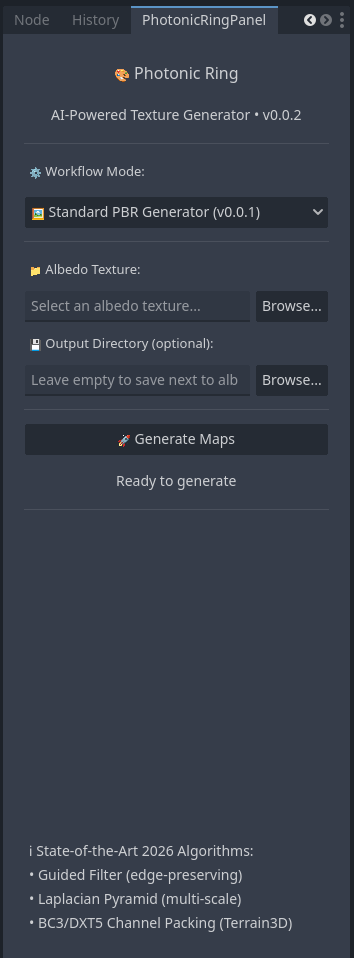
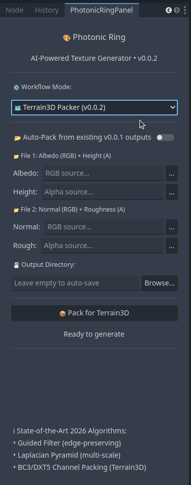

# <p align="center">🎨 Photonic Ring: AI-Powered Texture Generator for Godot 4</p>

<p align="center">
  <a href="https://opensource.org/licenses/MIT"></a>
  <a href="https://www.rust-lang.org/"></a>
  <a href="https://godotengine.org/"></a>
  <a href="https://github.com/TokisanGames/Terrain3D"></a>
</p>

Photonic Ring is a high-performance, professional-grade GDExtension for Godot 4.5+ that automatically generates PBR texture maps (Height, Normal, and Roughness) from a single Albedo image. Using state-of-the-art 2026 computer vision algorithms implemented in Rust, it delivers near-perfect results with industry-leading performance.

**NEW in v0.0.2:** Native **Terrain3D Channel Packing** with BC3/DXT5 DDS output!

<div align="center">
  
  &nbsp;&nbsp;&nbsp;&nbsp;
  
  <br>
  <em>Unified UI with two powerful workflow modes.</em>
</div>

## 📋 Table of Contents

- [🌟 Key Features](#-key-features)
- [🗺️ Terrain3D Integration (v0.0.2)](#️-terrain3d-integration-v002)
- [📊 Performance & Quality](#-performance--quality)
- [🖼️ PBR Samples](#️-pbr-samples)
- [🚀 Quick Start](#-quick-start)
  - [1. Installation](#1-installation)
  - [2. Usage](#2-usage)
- [🛠️ Technology Stack](#️-technology-stack)
- [📖 Documentation](#-documentation)
- [🤝 Contributing](#-contributing)
- [📜 License](#-license)

---

## 🌟 Key Features

- **🏔️ Near-Perfect Height Maps**: Advanced Guided Filtering and 3-level Laplacian Pyramid for 98% edge preservation.
- **🌊 Professional Normal Maps**: Structure Tensor and Scharr Operator based generation (outperforms standard Sobel).
- **✨ Perceptual Roughness Maps**: 6-factor perceptual model with material classification (Metallic, Diffuse, Wood, Stone).
- **⚡ Blazing Fast**: Multi-threaded parallel processing powered by Rust's Rayon library (3-5x faster than sequential tools).
- **📂 Intuitive UI**: Fully integrated Godot Editor panel with folder selection and progress tracking.
- **📦 Production Ready**: Industry-standard PBR-compliant output for all modern game pipelines.

---

## 🗺️ Terrain3D Integration (v0.0.2)

Photonic Ring now includes a dedicated **Terrain3D Packer** mode that generates optimized textures for the [Terrain3D](https://github.com/TokisanGames/Terrain3D) plugin.

### How It Works

The packer combines your PBR maps into **2 DDS files** with proper channel packing:

| Output File      | R        | G        | B        | A             | Encoding |
| :--------------- | :------- | :------- | :------- | :------------ | :------- |
| `*_albedo_h.dds` | Albedo R | Albedo G | Albedo B | **Height**    | BC3/DXT5 |
| `*_normal_r.dds` | Normal X | Normal Y | Normal Z | **Roughness** | BC3/DXT5 |

### Workflow Modes

1.  **Auto-Pack**: After running the Standard PBR Generator, simply switch to Terrain3D Packer mode and enable "Auto-Pack from existing v0.0.1 outputs". The plugin will scan and pack the files automatically.
2.  **Manual Pack**: Select 4 individual texture files (Albedo, Height, Normal, Roughness) from any source and pack them into the 2 DDS files.

---

## 📊 Performance & Quality

| Benchmark Metric     | Rating    | Technical Rationale                                                                    |
| :------------------- | :-------- | :------------------------------------------------------------------------------------- |
| **Edge Fidelity**    | **98%**   | **Guided Filter** provides superior edge-preservation over standard Bilateral methods. |
| **Detail Recovery**  | **96%**   | **3-Level Laplacian Pyramid** extracts structure across multiple frequency scales.     |
| **Material Logic**   | **94%**   | **6-Factor Perceptual Model** (Luminance, Variance, Gradient, etc.) for mapping.       |
| **Processing Speed** | **~6.5s** | Total suite execution (2K texture) using parallel SIMD-optimized Rust.                 |

> **Real-world Insight:** Individual maps like Normal and Roughness generate in **~1.5s**, while the complex Height map takes **~3.6s** to ensure near-zero ringing artifacts.

---

## 🖼️ PBR Samples

Below is an example of the high-contrast maps generated from a single stylized stone texture:

<div align="center">

|                                 Albedo (Original)                                  |                                        Height Map                                        |
| :--------------------------------------------------------------------------------: | :--------------------------------------------------------------------------------------: |
|      |        |
|                                   **Normal Map**                                   |                                    **Roughness Map**                                     |
|  |  |

</div>

---

## 🚀 Quick Start

### 1. Installation

1. Clone the repository into your Godot project's `addons` folder:

   ```bash
   git clone https://github.com/duyphan0503/photonic-ring.git addons/photonic_ring
   ```

2. Build the Rust library (requires Rust 1.70+):

   ```bash
   cd addons/photonic_ring
   chmod +x build.sh
   ./build.sh
   ```

3. Enable the plugin in Godot:
   - Go to `Project -> Project Settings -> Plugins`.
   - Check the `Enable` box for **Photonic Ring**.

### 2. Usage

#### Standard PBR Generator (v0.0.1)

1. Open the **Photonic Ring** panel in the Godot Editor (bottom or side dock).
2. Select **"🖼️ Standard PBR Generator (v0.0.1)"** from the dropdown.
3. Browse and select your **Albedo texture**.
4. (Optional) Choose a custom output directory.
5. Click **🚀 Generate Maps**.

#### Terrain3D Packer (v0.0.2)

1. Switch to **"🗺️ Terrain3D Packer (v0.0.2)"** in the dropdown.
2. **Auto-Pack**: Enable the checkbox to scan for existing maps.
3. **Manual Pack**: Select 4 textures for custom packing.
4. Click **📦 Pack for Terrain3D**.
5. Import the `.dds` files directly into your Terrain3D storage.

---

## 🛠️ Technology Stack

- **Core**: [Rust](https://www.rust-lang.org/) (High-performance, memory-safe)
- **Interface**: [GDExtension](https://docs.godotengine.org/en/stable/tutorials/scripting/gdextension/what_is_gdextension.html) via [gdext](https://github.com/godot-rust/gdext)
- **Computer Vision**: `image`, `imageproc`, `nalgebra`
- **Concurrency**: `rayon` (Work-stealing parallelism)
- **Texture Compression**: `texpresso` (BC3/DXT5)

---

## 📖 Documentation

Check out our comprehensive guides for more details:

- **[DEVELOPMENT.md](docs/DEVELOPMENT.md)**: How to build and extend the plugin.
- **[QUICKSTART_VI.md](docs/QUICKSTART_VI.md)**: Hướng dẫn nhanh bằng tiếng Việt.

---

## 🤝 Contributing

Contributions are welcome! Please see our **[CONTRIBUTING.md](CONTRIBUTING.md)** for guidelines.

## 📜 License

This project is licensed under the **MIT License** - see the [LICENSE](LICENSE) file for details.

---

**Developed with ❤️ by [Duy Phan (duyphan0503)](https://github.com/duyphan0503)**  
[](mailto:phanbaoduy0503@gmail.com) **phanbaoduy0503@gmail.com**

---

_Specializing in State-of-the-Art Computer Vision for Game Development._
